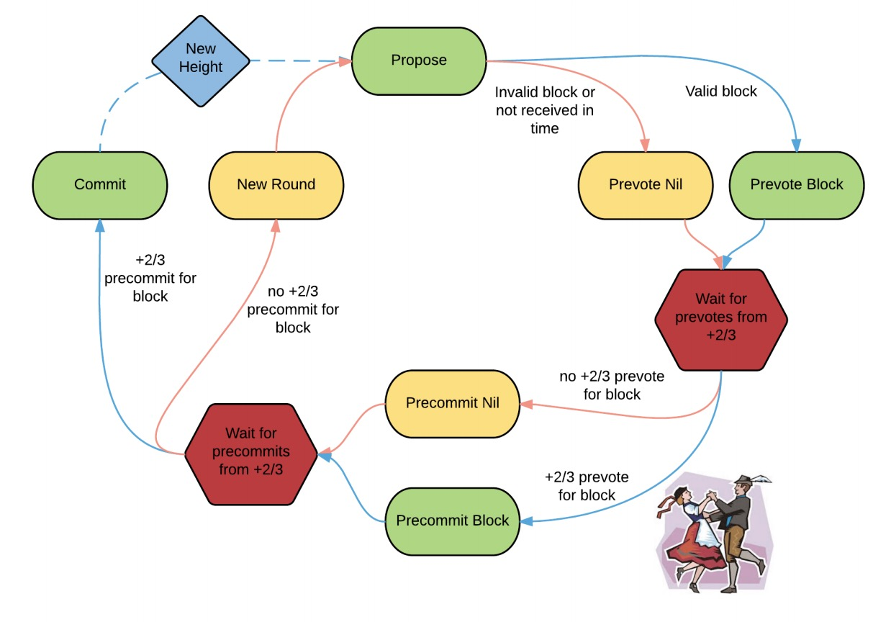
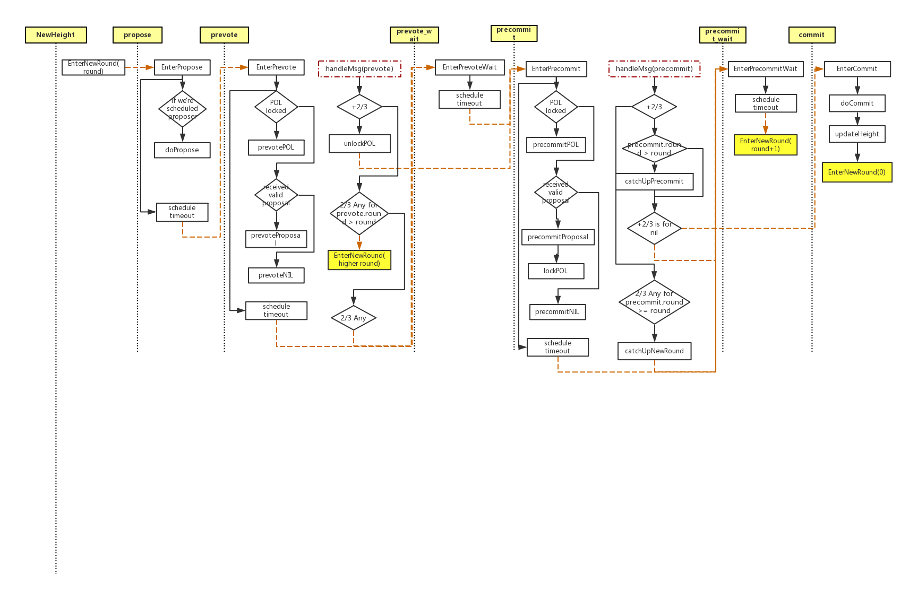

# goBFT
goBFT is a BFT library written in go. It's a re-implementation of tendermint bft.

# Terminology
* validator: all the nodes in a distributed system that participate in the consensus process
* POL: proof of lock. A validator reaches POL for a certain proposal when it receives
  +2/3 prevote for this proposal and precommit it. Once it reaches POL, the validator 
  can only prevote/precommit the POLed proposal in later rounds until it has a PoLC
* PoLC: proof of lock change (unlock previous POLed proposal). A validator reaches PoLC
  when it has +2/3 prevote for a different proposal in a higher round.
* To prevote or precommit something means to broadcast a prevote vote or precommit
  vote for something. e.g. prevotePOL means to broadcast a prevote vote for a POL
  proposal. prevoteNIL means to broadcast a prevote vote for nothing.
* +2/3 means a proposal got the vote from more than 2/3 of all the validators 
  in a certain round
* 2/3 Any: more than 2/3 of all the validators broadcast their votes, yet no proposal
  reached +2/3 (i.e. the validators voted for different proposals)
  
  To get more details of POL, please refer to [tendermint.pdf](https://allquantor.at/blockchainbib/pdf/buchman2016tendermint.pdf) chapter 3

## Note
* Proposer is decoupled from the goBFT library so that the user has control of when
  and what to propose. User has to implement the `Proposer` interface.
* `Commiter` interface has to be implemented by user to specify the actions taken when validators
  reaches consensus about a certain `Proposal`.

# Data flow and state transition

