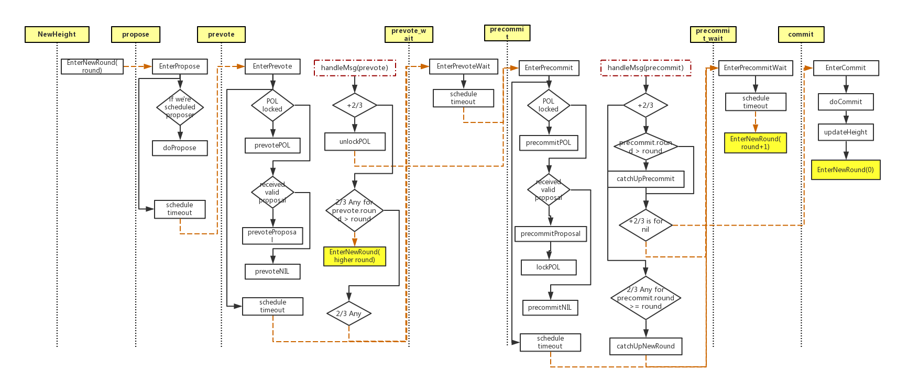

# go-bft
go-bft is a BFT library written in go. It's a re-implementation of tendermint bft.


# Terminology
* validator: all the nodes in a distributed system that participate in the consensus process
* POL: proof of lock. A validator reaches POL for a certain proposal when it receives
  +2/3 prevote for this proposal and precommit it. Once it reaches POL, the validator 
  can only prevote/precommit the POLed proposal in later rounds until it has a PoLC
* PoLC: proof of lock change (unlock previous POLed proposal). A validator reaches PoLC
  when it has +2/3 prevote for a different proposal in a higher round.
* To prevote or precommit something means to broadcast a prevote vote or precommit
  vote for something. e.g. prevotePOL means to broadcast a prevote vote for a POL
  proposal. prevoteNIL means to broadcast a prevote vote for nothing.
* +2/3 means a proposal got the vote from more than 2/3 of all the validators 
  in a certain round
* 2/3 Any: more than 2/3 of all the validators broadcast their votes, yet no proposal
  reached +2/3 (i.e. the validators voted for different proposals)
  
  A validator is a node in a distributed system that participates in the
  bft consensus process. It proposes and votes for a certain proposal.
  Each validator should maintain a set of all the PubValidators so that
  it can verifies messages sent by other validators. Each validator should
  have exactly one PrivValidator which contains its private key so that
  it can sign a message. A validator can be a proposer, the rules of which
  validator becomes a valid proposer at a certain time is totally decided by user.
  
  To get more details of POL, please refer to [tendermint.pdf](https://allquantor.at/blockchainbib/pdf/buchman2016tendermint.pdf) chapter 3

## Note
* Proposer is decoupled from the go-bft library so that the user has complete control of when
  and what to propose. User has to implement the `Proposer` interface.
* `Committer` interface has to be implemented by user to specify the actions taken when validators
  reaches consensus about a certain `Proposal`.
* `PubValidator` and `PrivValidator` interface provides a abstract access of user-defined
  signature type(e.g. ecc or rsa)
  
 In a nutshell, user should implement the following interface:
 ```go
// Proposer stages a candidate data so that other validators can vote for it
type Proposer interface {
	GetCurrentProposer()
	Propose() (*message.Proposal, error)
	// Each Validator will vote for the POLed proposal if there's any. Otherwise it
	// votes for the first proposal it sees in default unless user explicitly calls
	// BoundVotedData(data), in which case it votes for the bounded data.
	BoundVotedData(data []byte)
}

// PubValidator verifies if a message is properly signed by the right validator
type PubValidator interface {
	VerifySig(digest, signature []byte) bool
	GetPubKey() PubKey
}

// PrivValidator signs a message
type PrivValidator interface {
	GetPubKeyBytes() PubKey
	Sign(digest []byte) []byte
}

// Committer defines the actions the users taken when consensus is reached
type Committer interface {
    Commit(p *message.Proposal) error
}
```

# Data flow and state transition

